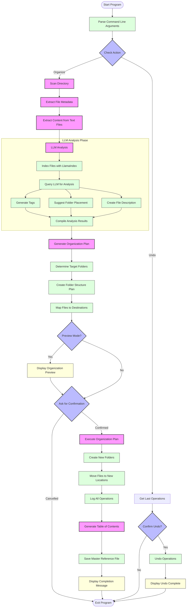

# LLM Directory Organizer: Program Flow

## Component Descriptions

### 1. Command Parsing
- Parses command line arguments to determine the action (organize or undo)
- Sets options like recursive scanning and preview mode

### 2. Directory Scanning Phase
- Scans target directory recursively or non-recursively
- Extracts metadata from all files (name, size, type, dates)
- Extracts content from compatible text-based files

### 3. LLM Analysis Phase
- Uses LlamaIndex to index file content and metadata
- Queries the LLM to:
  - Generate relevant tags for each file
  - Suggest appropriate folder placement
  - Create a brief description of the file's content
- Compiles all analysis results into a structured dataset

### 4. Organization Planning Phase
- Generates a comprehensive organization plan
- Determines which folders need to be created
- Maps each file to its destination folder

### 5. Preview & Confirmation Phase
- Displays the proposed organization changes to the user
- Shows before/after file structure
- Asks for confirmation before proceeding

### 6. Execution Phase
- Creates new folders according to the plan
- Moves files to their designated locations
- Logs all operations for potential rollback

### 7. Documentation Phase
- Generates a master table of contents
- Records original locations, new locations, and file descriptions
- Saves information as a reference file

### 8. Undo Functionality
- Retrieves the log of the last organization operation
- Confirms with the user before proceeding
- Reverts all file moves by moving files back to original locations
- Removes empty folders that were created 